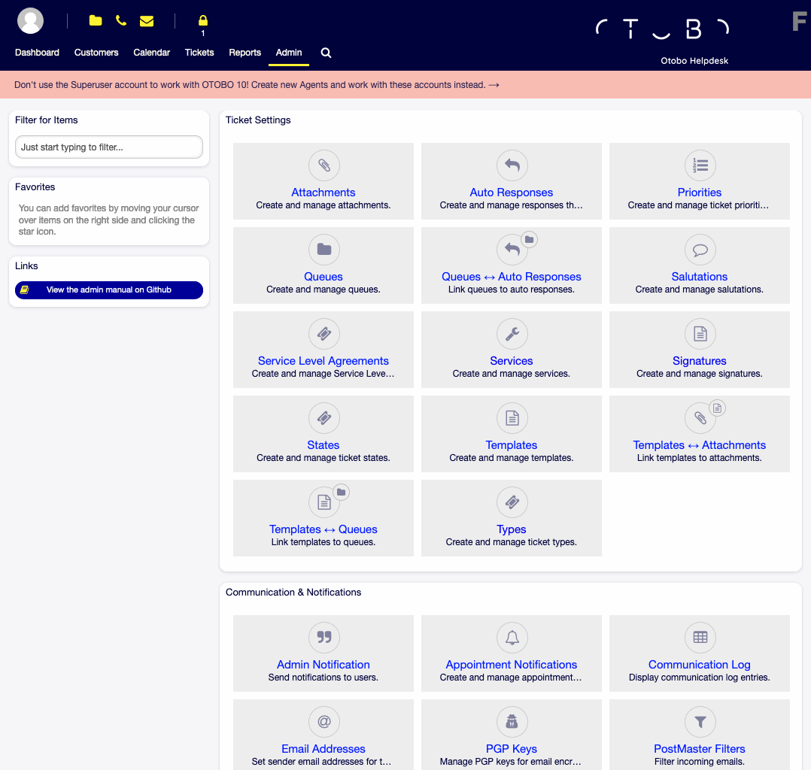

Administration Area
===================

The Administration Area is available in the *Admin* menu item of the main menu, when you logged in as an administrator.
Administrators are users, who are member of the *admin* group.

   Administrator Interface

The administrator interface contains several modules collected into groups.
Use the filter box in the left sidebar to find a particular module by just typing the name to filter.

This manual shows the configuration possibilities needed to solve common problems.
The chapters:

1. Identify a typical use-case for the administrator, to aid in orientation, and explain **what** OTOBO does to provide a solution (**warranty**).
2. Direct you **how** to configure OTOBO to fit your use-case (**utility**).

The chapters are the same as the modules in the administrator interface.
The order of the chapters are also the same as they are displayed alphabetically in the (English) administrator interface.

.. toctree::
   :maxdepth: 3
   :caption: Contents

   administration-area/ticket-settings
   administration-area/communication-notifications
   administration-area/users-groups-roles
   administration-area/processes-automation
   administration-area/customer-interface
   administration-area/languages
   administration-area/otobo-services
   administration-area/administration
