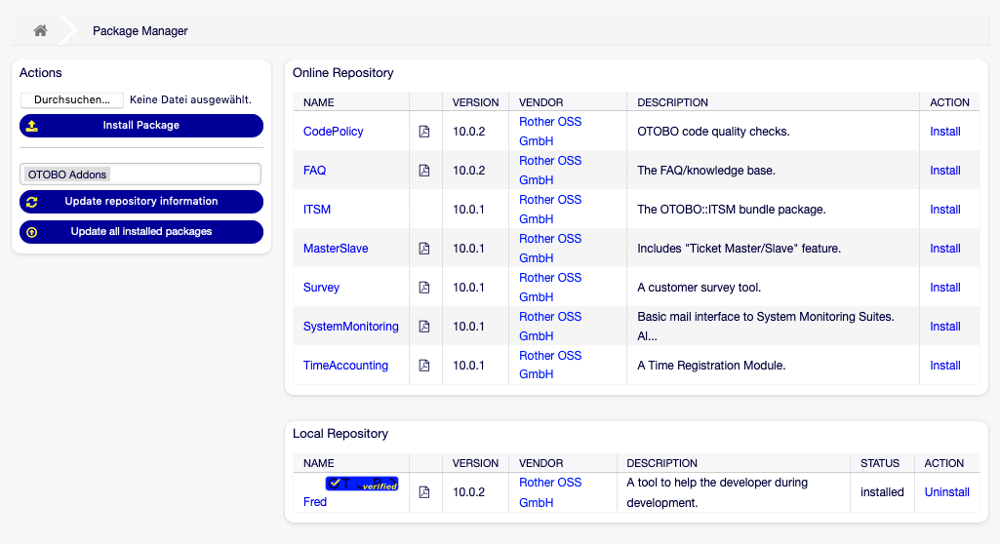
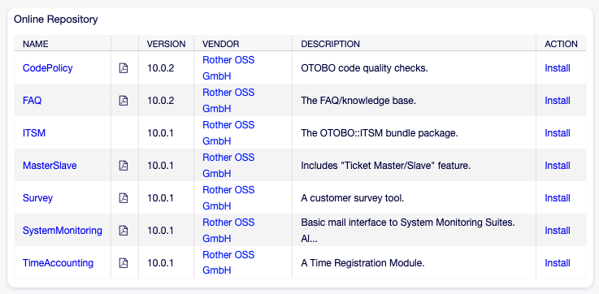
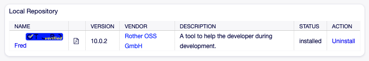

Package Manager
===============

OTOBO is a modular system that can be extended by adding additional software packages to the framework.
Administrators are provided with an easy way to see which features are installed in which version and for sure to add, update and remove packages.
OTOBO uses a package manager to perform all package-related activities as mentioned above in the graphical interface.

The package manager is listed in the *Package Manager* tile of the *Administration* group of the Admin Interface.
Use this interface to install, remove and manage packages that extend the functionality of OTOBO.

   Package Manager Screen

.. important::

   You may view the package documentation of each package even prior to installation by clicking the PDF-symbol next to the package name.

Install Packages
----------------

You have two options to install new packages to your OTOBO, either from an online repository or by installation of a local package file.
You should prefer package from an repository as it eases consuming of updates if available.

.. hint::

   The installation of packages not verified by Rother OSS is possible by default.
   We love open source.
   You can deactivate the installation of not-verified packages in the system configuration setting ``Package::AllowNotVerifiedPackages``.

Install from Repository
~~~~~~~~~~~~~~~~~~~~~~~

To install a package from an online repository, follow these steps:

#. Select an online repository from the drop-down in the left sidebar.
   The Rother OSS repository is configured by default.
#. Click on the *Update repository information* button to refresh the available package list.
#. Select a package from the *Online Repository* widget and click on the *Install* in the last column.
#. Follow the installation instructions.
#. After installation, the package is displayed in the *Local Repository* widget.

   Online Repository Widget

.. seealso::

   The repository list can be changed in system configuration setting ``Package::RepositoryList``.

Install from File
~~~~~~~~~~~~~~~~~

Sideloading packages is also posible.
To install a package from file follow these steps:

#. Click on the *Browse…* button in the left sidebar.
#. Select an ``.opm`` file from your local file system.
#. Click on the *Install Package* button.
#. Follow the installation instructions.
#. After installation, the package is displayed in the *Local Repository* widget.

   Local Repository Widget

Reinstall Packages
~~~~~~~~~~~~~~~~~~

If at least one of the package files are modified locally, the package manager marks the package as broken.
You may overwrite these modifications by a reinstall.

To reinstall a package:

#. Select the package from the *Local Repository* widget that are marked for reinstall.
#. Click on the *Reinstall* link in the *Action* column.
#. Follow the installation instructions.

Update Packages
---------------

Using the online repository to install packages, provides you a hint, if an update to the package is available in the *Action* column.
To update a package from online repository follow these steps:

#. Check the available packages in the *Online Repository* widget for *Update* in the *Action* column.
#. Click on the *Update* link.
#. Follow the update instructions.
#. After updating, the package is displayed in the *Local Repository* widget.

To update all packages:

#. Click on the *Update all installed packages* button in the left sidebar.
#. Follow the update instructions.
#. After updating, the package is displayed in the *Local Repository* widget.

This feature reads the information of all defined package repositories and determines whether a new version for every installed package exsits in the repository.
It calculates the correct order to update the packages respecting all other package dependencies, even if new versions of existing packages require new packages not yet installed in the system.

.. note::

   To update a package that was installed from a file, simply install the newer version as explained above.
   However, they may not be updated by the button in the sidebar.

Remove Packages
---------------

.. danger::

   If you remove a package you also delete all data managed by that package.

If a certain package is no longer required, you may remove it.
To uninstall a package follow these steps:

1. Select the package from the *Local Repository* widget.
2. Click on the *Uninstall* link in the *Action* column.
3. Follow the uninstall instructions.

   Local Repository Widget
