.. toctree::
   :maxdepth: 3
   :caption: Contents
   
OIDC bases OAuth2 Authentication for Email receiving and sending using XOAUTH2 or OAUTHBEARER
=============================================================================================

Regardless whether OAuth2 is used for sending or fetching email, a valid OAuth2 FunctionalAccount and its corresponding
OIDC provider settings need to be configured in the Admin UI. These can be set up using the 'OAuth Functional Accounts' and 'OIDC Profile Management' modules in the Admin UI, respectively.

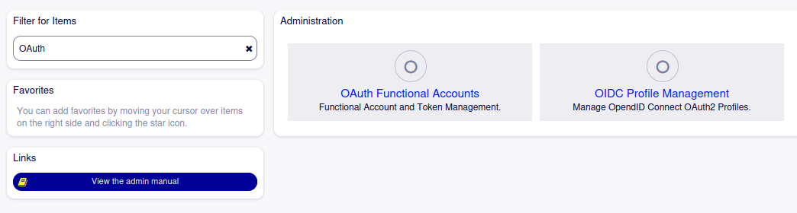

Please refer to the OAuth2 manual for more information on the options for setting up OIDC Profiles and/or OAuth2 Functional Accounts.

**Note**: On the OIDC Provider the Functional Account user must have the proper permissions assigned, as these will be specific to mail server and OIDC Provider used please 
refer to your email provider's instructions on how to setup authentication via OIDC.

**Note**: The Functional Account configured in Otobo will possibly need to have the proper OAuth2 scopes and/or resource ids configured specific to the mail server 
and OIDC Provider used. Again please refer to your email provider's documentation to determine the necessary settings.

SMTP
----

For ougoing email sending via SMTP, OAuth2 authentication has to be enabled in SysConfig under Core > Email:

- The SendmailModule setting must be one of the SMTP options. Choosing SMTPS or SMTPTLS is strongly recommended from a security perspective, do *not* use unencrypted SMPT with OAuth2 tokens in a production environment
- Make sure you use the proper SendmailModule::Port for the chosen SMTP method
- The SendmailModule::OAuth2Method setting must be set to either XOAUTH2 or OAUTHBEARER
- The SendmailModule::OAuth2FunctionalAccount setting must be set to the name of an OAuth Functional Account configured in the Admin UI as outlined above
- The SendmailModule::AuthUser must be set to the username of the FunctionalAccount that is used to send email
- The SendmailModule::AuthPassword will *not* be used with XOAUTH2 and/or OAUTHBEARER

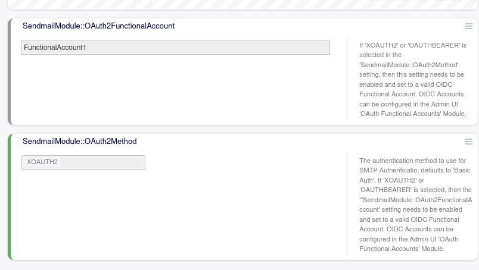

POP3/IMAP
---------

For incoming email fetched via POP3 or IMAP, settings can be provided via the Admin UI Postmaster Mailaccounts module.

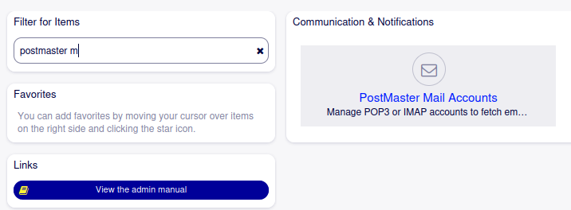

To enable XOAUTH2 or OAUTHBEARER For a given Postmaster mail account, do:    

- Change the authentication option from the default 'Basic Auth' option to either XOAUTH2 or OAUTHBEARER depending on your needs
- Select the Functional Account to be used for fetching email that you have configured above from the drop down list
- Specify the username of the FunctionalAccount that is used to fetch email

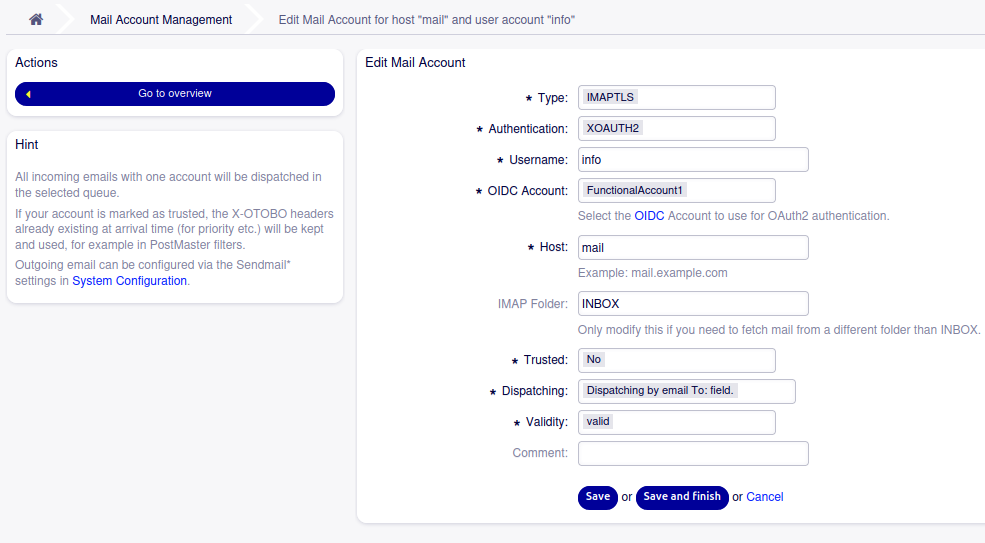

**Note**: Do *not* use unencrypted POP3 or IMAP protocols with OAuth tokens in a production environment. Always prefer to use the enrypted TLS or STARTTLS 
protocols for POP3 (POP3S or POP3TLS) or for IMAP (IMAPS or IMAPTLS).

Configuration Reference
-----------------------

Core::Email
^^^^^^^^^^^^^^^^^^^^^^^^^^^^^^^^^^^^^^^^^^^^^^^^^^^^^^^^^^^^^^^^^^^^^^^^^^^^^^^^^^^^^^^^^^^^^^^^^^^^^^^^^^^^^^^^^^^^^^^^^^^^^^

SendmailModule::OAuth2FunctionalAccount
""""""""""""""""""""""""""""""""""""""""""""""""""""""""""""""""""""""""""""""""""""""""""""""""""""""""""""""""""""""""""""""
If 'XOAUTH2' or 'OAUTHBEARER' is selected in the 'SendmailModule::OAuth2Method' setting, then this setting needs to be enabled and set to a valid OIDC Functional Account. OIDC Accounts can be configured in the Admin UI 'OAuth Functional Accounts' Module.

SendmailModule::OAuth2Method
""""""""""""""""""""""""""""""""""""""""""""""""""""""""""""""""""""""""""""""""""""""""""""""""""""""""""""""""""""""""""""""
The authentication method to use for SMTP Authentication, defaults to 'Basic Auth'. If 'XOAUTH2' or 'OAUTHBEARER' is selected, then the '"SendmailModule::OAuth2FunctionalAccount' setting needs to be enabled and set to a valid OIDC Functional Account. OIDC Accounts can be configured in the Admin UI  'OAuth Functional Accounts' Module.

Azure Configuration
~~~~~~~~~~~~~~~~~~~ 

Go to https://portal.azure.com

**In the next step switch to ``Azure Active Directory`` and add a new ``Enterprise Application``:**
"""""""""""""""""""""""""

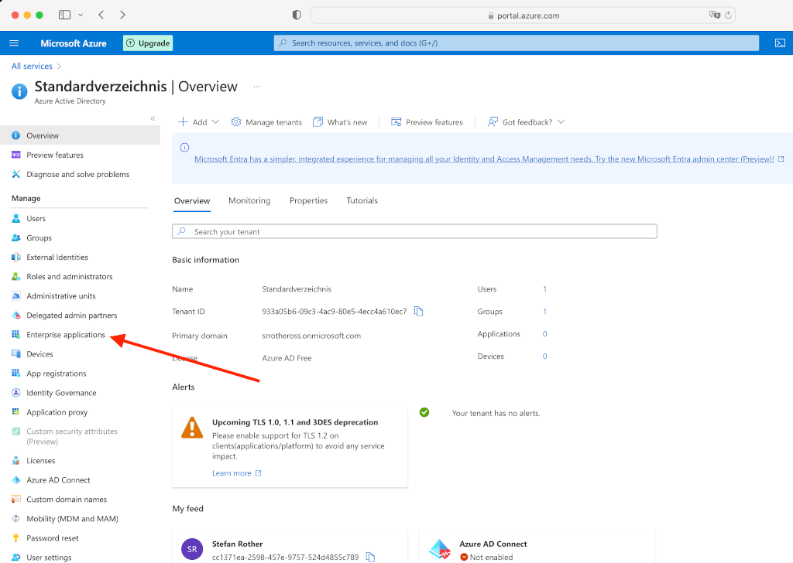
   
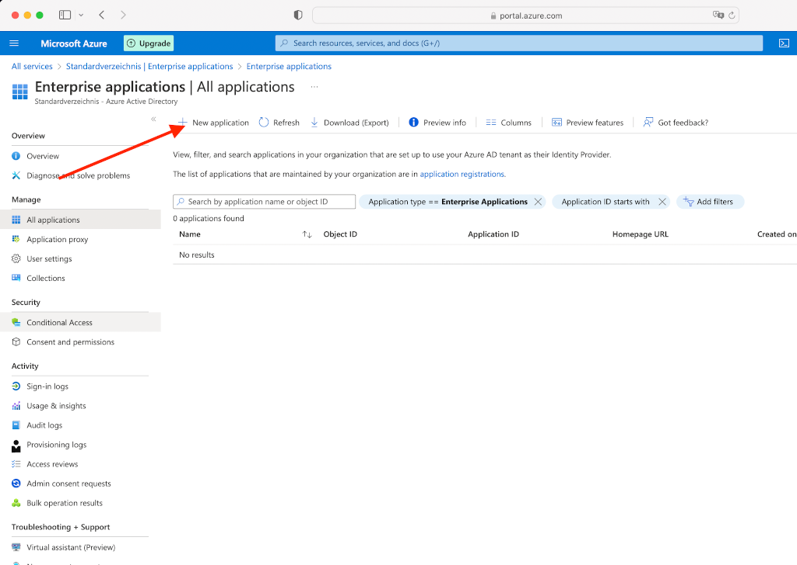
   
**Create your own application**
"""""""""""""""""""""""""
   
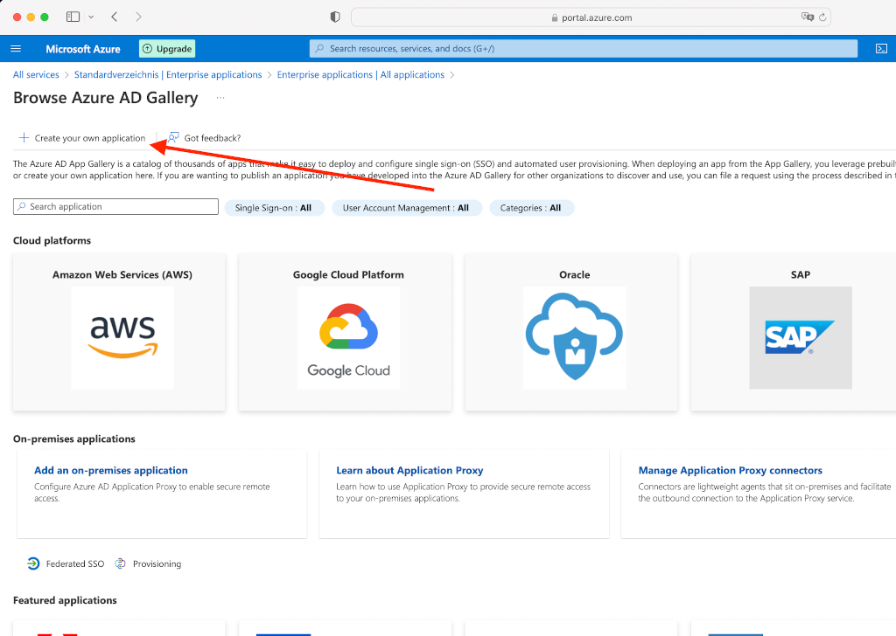
   
**Assign a name to the app**
"""""""""""""""""""""""""

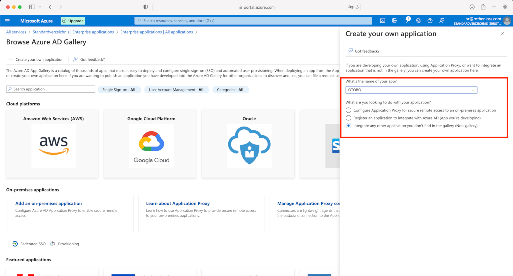
   
**The mailbox user must be assigned to the application. You will need the Application ID lateron in OTOBO (Attention, the application ID of the "Enterprise APP" may differ from that of the "Application Registration". In this case, please use the Application/Client ID of the registration.).**
"""""""""""""""""""""""""

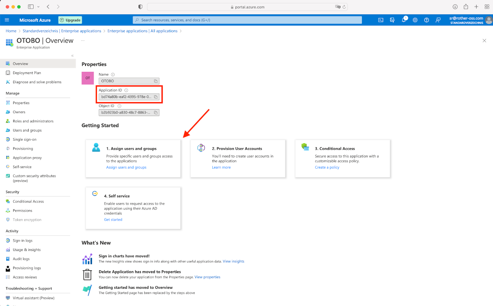
   
**You will also need the domain's tenant ID***
"""""""""""""""""""""""""

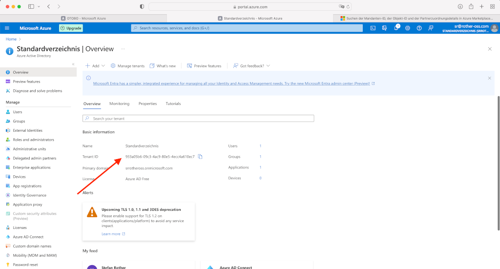
   
**In the next step you have to add a new app in App registration.**
"""""""""""""""""""""""""

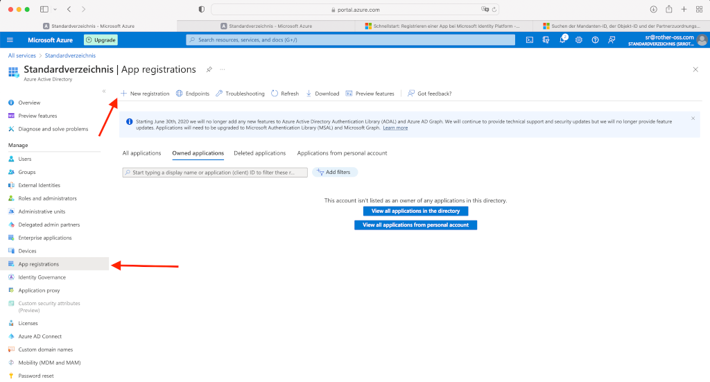
   
**Create a Redirect URL of type Web and a secret client key.**
"""""""""""""""""""""""""
Redirect URL = https://<OTOBO address>/otobo/index.pl?Action=AdminMailAccount

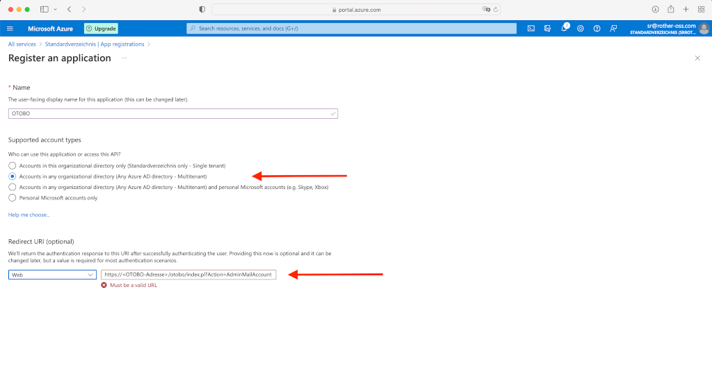
   
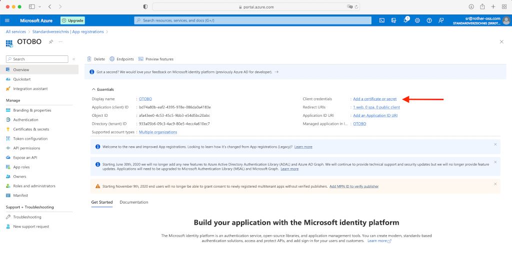
   
   Please add a new client secret and note the value (not the secret id) as we need it later. It will only appear during the creation and you will not be able to see it afterwards anymore. Apparently Microsoft only allows a time of validity for two years max.
   
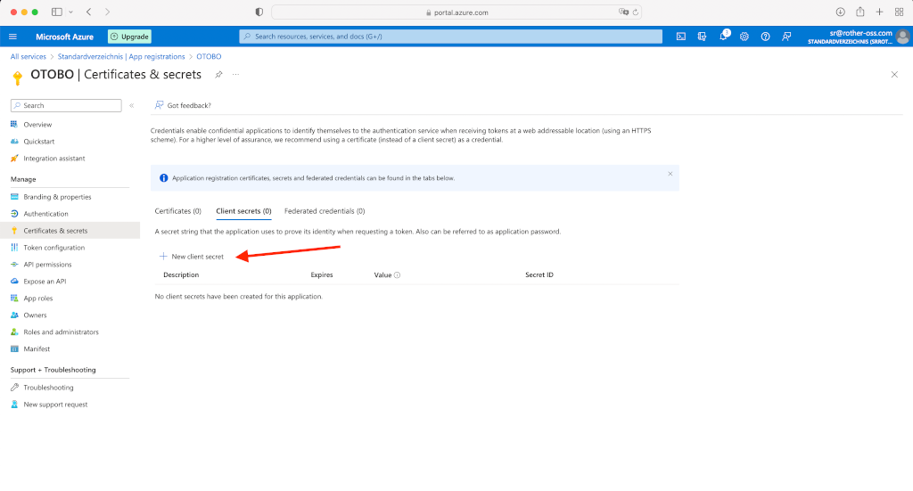
  
**Switch to ``API permissions`` and add ``IMAP.AccessAsUser.All`` and ``POP.AccessAsUser.All``**
"""""""""""""""""""""""""

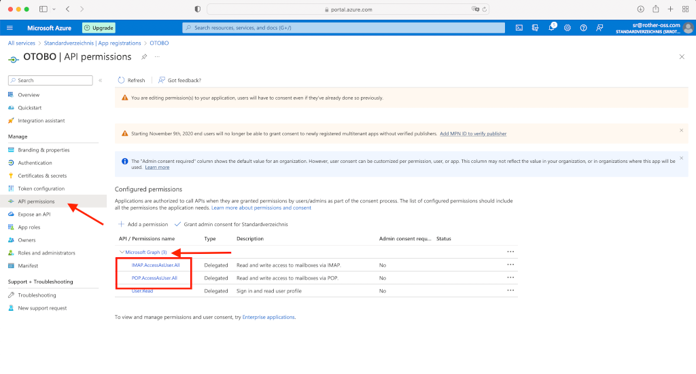
   
   Please click on "Add permission" and choose Microsoft Graph, then new delegated permissions in the bar on the right. If Microsoft Graph is no show up as like in the screenshot.
   
**The Azure configuration is now complete. Please check whether port 143 and 993 are enabled.**
"""""""""""""""""""""""""

