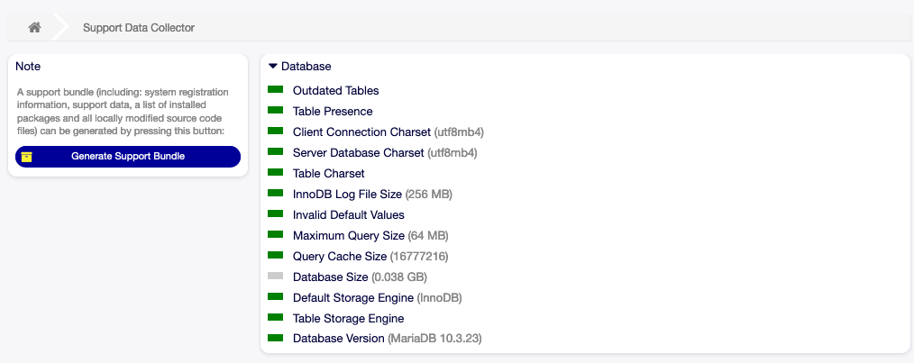
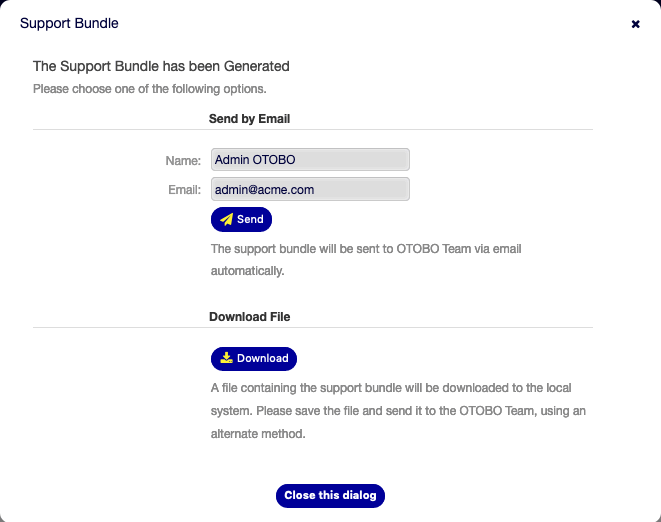

OTOBO Team Services
===================

This section describes the functionality of your OTOBO to support you OTOBO service partner.
Regardless whether this is Rother OSS, an OTOBO Partner, or any other service provider of your choosing.

Support Data Collector
----------------------

The Support Data Collector is used to collect characteristic data of your OTOBO installation.
Use this screen to review the data and download it as a bundle.

   Download Support Bundle Screen

To generate a support bundle:

1. Click on the *Generate Support Bundle* button in the left sidebar.
2. Send the bundle to your admin email address of download it as a `.tar.gz`.

   Download Support Bundle Dialog

You may just unpack the bundle and inspect it's content.
The bundle contains:

1. All information rendered on this site: ``SupportData.json``.
2. A list of all installed packages: ``InstalledPackages.csv``.
3. A list of all modified settings: ``ModifiedSettings.csv``.
4. A snapshot of all modified files in the system: ``application.tar.gz``.

.. note::
   Passwords are redacted in the generated bundle.

Collected Data
^^^^^^^^^^^^^^

The screen contains several sections.
Each section has some entries accompanied by a traffic light, that indicates the following:

- Gray LED is *informational* only.
- Green LED means that the values is within good range.
- Yellow LED means notification, you have to check the value, but it is not an error.
- Red LED means error, you have to do something to solve the issue.

Cloud Services
--------------

.. note::
   Rother OSS does not collect any data of your OTOBO.
   There are no cloud services you may register to at this point.

