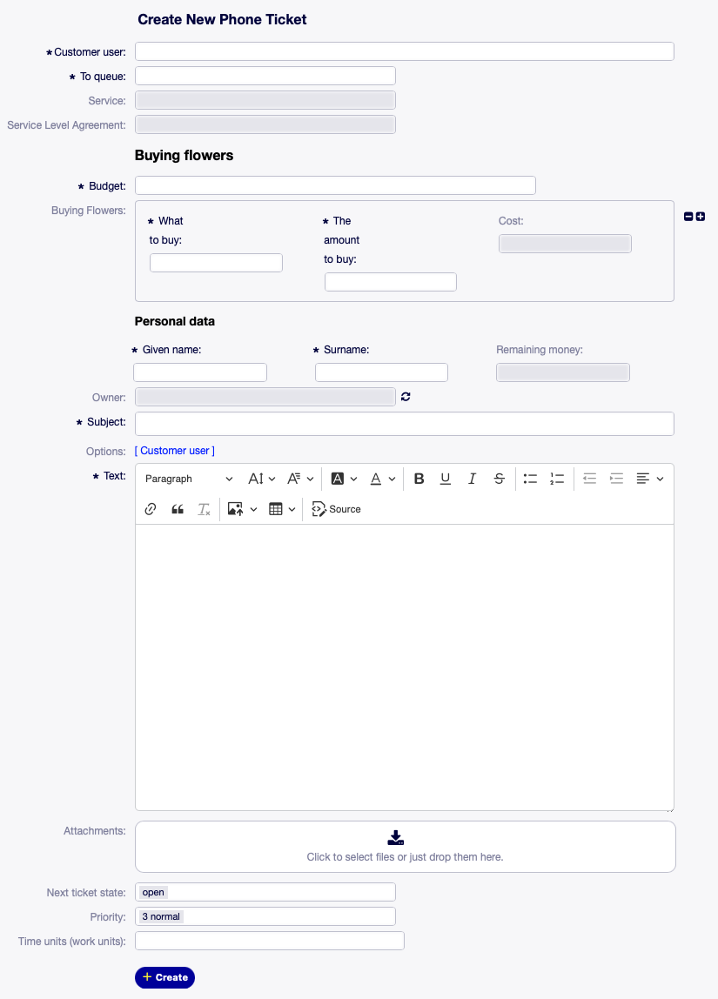

Ticket Masks
============

With ticket masks you are able to define your own forms, for specific actions.
Every action (e.g. AgentTicketPhone, CustomerTicketMessage, etc.) can have its own ticket mask.

To create a ticket mask you have to write the definition in YAML-code.

In the following example you see a ticket mask, that enhances the action AgentTicketPhone to look like:

   Example of a ticket mask for action AgentTicketPhone

If you want to know how to configure this please head over to our :doc:`How-To <../../how-tos/create-ticket-masks>`.