Web Services
============

In a connected world, a ticket system needs to be able to react to requests from other systems and also to send requests or information to other systems:

* CRM systems
* Project management systems
* Documentation management systems
* and many more

The ticket system must be reachable by other services without manual intervention by an agent.

OTOBO supports this requirement by the *Generic Interface*. It empowers the administrator to create a web service for a specific task without scripting language knowledge. OTOBO reacts on incoming REST or SOAP requests and creates objects or provides object data to other systems transparently.

A web service is a communication method between two systems, in our case OTOBO and a remote system. In its configuration, the :term:`operation` or :term:`invoker` determine the direction of communication, and the :term:`mapping` and :term:`transport` take care of how the data is received and interpreted.

By configuration, you can define what actions the web service can perform internally (operation), what actions the OTOBO request can perform on a remote system (invokers), how data is converted from one system to the other (mapping), and which protocol is used for communication (transport).

The generic interface is the framework which makes it possible to create web services for OTOBO in a predefined way, using ready-made building blocks that are independent from each other and interchangeable.

Use this screen to manage web services in the system. A fresh OTOBO installation contains no web service by default. The web service management screen is available in the *Web Services* module of the *Processes & Automation* group.

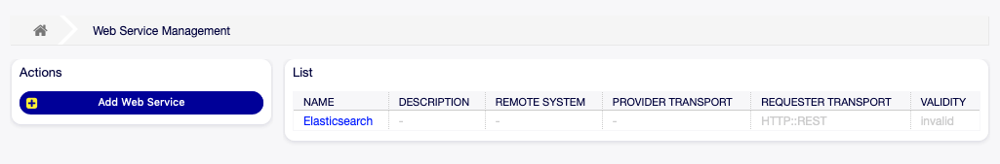

   Web Service Management Screen

Manage Web Services
-------------------

To create a web service:

1. Click on the *Add Web Service* button in the left sidebar.
2. Fill-in the required fields.
3. Click on the *Save* button.

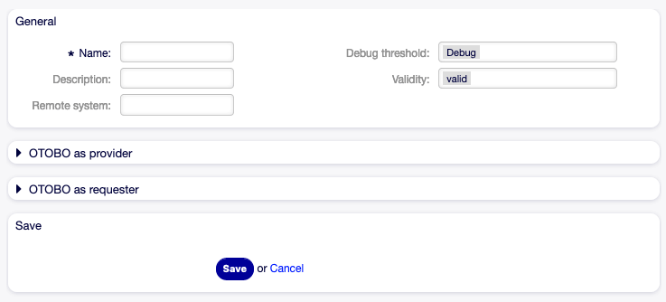

   Create New Web Service Screen

To edit a web service:

1. Click on a web service in the list of web services.
2. Modify the fields.
3. Click on the *Save* or *Save and finish* button.

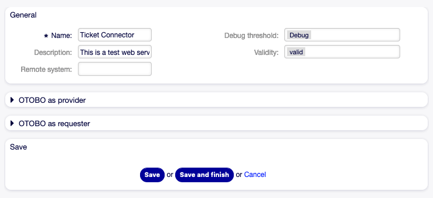

   Edit Web Service Screen

To delete a web service:

1. Click on a web service in the list of web services.
2. Click on the *Delete Web Service* button in the left sidebar.
3. Click on the *Delete* button in the confirmation dialog.

   Delete Web Service Screen

To clone a web service:

1. Click on a web service in the list of web services.
2. Click on the *Clone Web Service* button in the left sidebar.
3. Enter a new name for the web service.

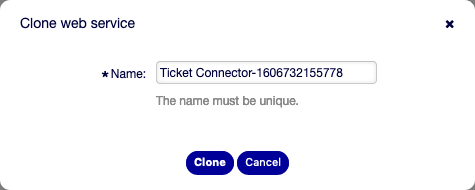

   Clone Web Service Screen

To export a web service:

1. Click on a web service in the list of web services.
2. Click on the *Export Web Service* button in the left sidebar.
3. Choose a location in your computer to save the ``Export_ACL.yml`` file to.

.. warning::

   All stored passwords in the web service configuration will be exported in plain text format.

To see the configuration history of a web service:

1. Click on a web service in the list of web services.
2. Click on the *Configuration History* button in the left sidebar.

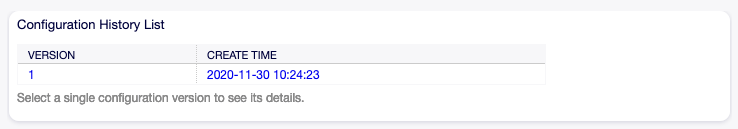

   Web Service Configuration History Screen

To use the debugger for a web service:

1. Click on a web service in the list of web services.
2. Click on the *Debugger* button in the left sidebar.

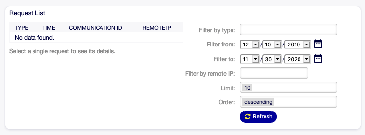

   Web Service Debugger Screen

To import a web service:

1. Click on the *Add Web Service* button in the left sidebar.
2. Click on the *Import Web Service* button in the left sidebar.
3. Click on the *Browse…* button in the dialog.
4. Select a previously exported ``.yml`` file.
5. Add a name for the imported web service (optional). Otherwise the name will be taken from the configuration file name.
6. Click on the *Import* button.

Web Service Settings
--------------------

The following settings are available when adding or editing this resource. The fields marked with an asterisk are mandatory.

General Web Service Settings
~~~~~~~~~~~~~~~~~~~~~~~~~~~~

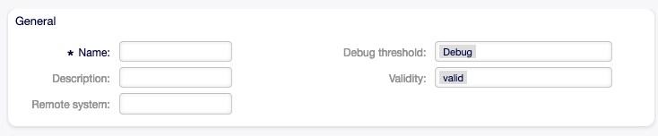

   Web Service Settings - General

Name \*
   The name of this resource. Any type of characters can be entered to this field including uppercase letters and spaces. The name will be displayed in the overview table.

Description
   Like comment, but longer text can be added here.

Remote system
   .. TODO: what is this?

Debug threshold
   The default value is *Debug*. When configured in this manner, all communication logs are registered in the database. Each subsequent debug threshold value is more restrictive and discards communication logs of lower order than the one set in the system.

   Debug threshold levels (from lower to upper):

   - Debug
   - Info
   - Notice
   - Error

Validity
   Set the validity of this resource. Resources can only be used in OTOBO if this field is set to *valid*. Setting this field to *invalid* or *invalid-temporarily* will disable the use of the resource.

Provider Web Service Settings
~~~~~~~~~~~~~~~~~~~~~~~~~~~~~

.. note::

   To access the otobo webservice, please use the following URL:

   .. code-block:: none

      https://SERVER-ADDRESS/otobo/nph-genericinterface.pl/Webservice/WEB-SERVICE-NAME/OPERATION

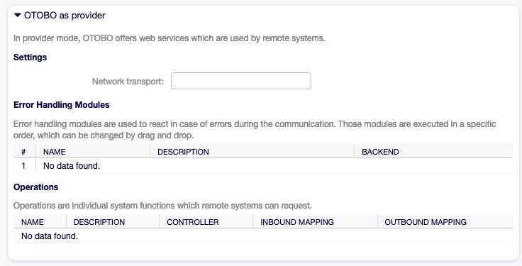

   Web Service Settings - OTOBO as Provider

Network transport
   Select which network transport you would like to use with the web service. Possible values are *HTTP::REST* and *HTTP::SOAP*.

   .. note::

      After selecting the transport method, you have to save the configuration by clicking on the *Save* button. A *Configuration* button will be displayed next to this field.

Configuration
   The *Configuration* button is visible only after a network transport was selected and saved. See the configuration for *OTOBO as Provider - HTTP\:\:REST* and *OTOBO as Provider - HTTP\:\:SOAP* below.

Add Operation
   This option is visible only after a network transport was selected and saved. Selecting an operation will open a new screen for configuration.

   .. figure:: images/web-service-add-operation.png
      :alt: Web Service Settings - OTOBO as Provider - Operation

      Web Service Settings - OTOBO as Provider - Operation

OTOBO as Provider - HTTP\:\:REST
^^^^^^^^^^^^^^^^^^^^^^^^^^^^^^^^

To use the OTOBO REST interface, choose the network transport method "HTTP\:\:REST".
Save and reload the screen to load the ticket operations.

   Web Service Settings - OTOBO as Provider - HTTP\:\:REST

You should now be able to select an operation.

Operations
~~~~~~~~~~

There are different Ticket Operations which all serve a specific job:

- `Ticket::TicketCreate`
- `Ticket::TicketGet`
- `Ticket::TicketSearch`
- `Ticket::TicketUpdate`
- `Ticket::TicketHistoryGet`

In this example, we are going to use the Ticket::TicketCreate operation. Click on "Add Operation" and choose the "Ticket::TicketCreate" operation.
Choose a descriptive name, save the operation and go back to the webservice overview.

You now should see a new entry "Route mapping for Operation 'TicketCreate'".
Enter for example "/TicketCreate"

This will define the route, which will translate to:
``https://YOURSERVER/otobo/nph-genericinterface.pl/Webservice/<WEBSERVICE_NAME>/TicketCreate``

Click "Save and finish".

Now you can send a request to the endpoint.

Here is an example using curl:

.. code-block:: bash

   curl -X POST --header "Content-Type: application/json" \
     --data '{
       "UserLogin": "AgentUser",
       "Password": "Password",
       "Ticket": {
         "Title": "created by Webservice request",
         "QueueID": 5,
         "CustomerUser": "CustomerUser",
         "State": "new",
         "PriorityID": 1
       },
       "Article": {
         "CommunicationChannel": "Email",
         "From": "test@test.de",
         "Subject": "Webservice Create Example",
         "Body": "This was created by a Webservice request!",
         "ContentType": "text/html charset=utf-8"
       }
     }' \
     https://YOURSERVER/otobo/nph-genericinterface.pl/Webservice/<WEBSERVICE_NAME>/TicketCreate

This request is using the least amount of attributes needed to create a new ticket.

A full list of all attributes needed for operations can be found here:
 - TicketCreate: https://github.com/RotherOSS/otobo/blob/rel-11_0/Kernel/GenericInterface/Operation/Ticket/TicketCreate.pm#L77
 - TicketGet: https://github.com/RotherOSS/otobo/blob/rel-11_0/Kernel/GenericInterface/Operation/Ticket/TicketGet.pm#L73
 - TicketUpdate: https://github.com/RotherOSS/otobo/blob/rel-11_0/Kernel/GenericInterface/Operation/Ticket/TicketUpdate.pm#L77
 - TicketSearch: https://github.com/RotherOSS/otobo/blob/rel-11_0/Kernel/GenericInterface/Operation/Ticket/TicketSearch.pm#L70
 - TicketHistoryGet: https://github.com/RotherOSS/otobo/blob/rel-11_0/Kernel/GenericInterface/Operation/Ticket/TicketHistoryGet.pm#L67

XSLT-Mapping for OTOBO as Provider - HTTP\:\:REST
~~~~~~~~~~~~~~~~~~~~~~~~~~~~~~~~~~~~~~~~~~~~~~~~~

The XSLT standard can be used to transform XML, JSON and CSV data.

In this example, we are going to use the XSLT mapping to transform the response from the webservice into Dynamic Fields.

Create a Dynamic Field of Type Ticket->Text and name it for example "RemoteTicketID".

Given the incoming data:

.. code-block:: none

   { "incidentID" : "12345", "incidentTitle" : "Test Ticket" }

We can save the data in the Dynamic Field as follows:

.. code-block:: none

   <example code here>

OTOBO as Provider - HTTP\:\:SOAP
^^^^^^^^^^^^^^^^^^^^^^^^^^^^^^^^

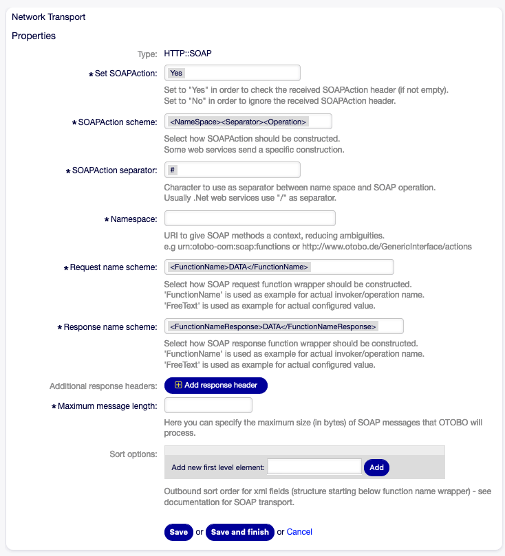

   Web Service Settings - OTOBO as Provider - HTTP\:\:SOAP

Requester Web Service Settings
~~~~~~~~~~~~~~~~~~~~~~~~~~~~~~

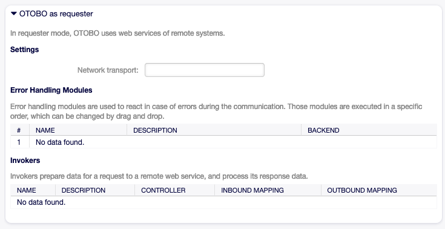

   Web Service Settings - OTOBO as Requester

Network transport
   Select which network transport would you like to use with the web service. Possible values are *HTTP::REST* and *HTTP::SOAP*.

   .. note::

      After selecting the transport method, you have to save the configuration by clicking the *Save* button. A *Configuration* button will be displayed next to this field.

Configuration
   The *Configuration* button is visible only after a network transport was selected and saved. See the configuration for *OTOBO as Requester - HTTP\:\:REST* and *OTOBO as Requester - HTTP\:\:SOAP* below.

Add error handling module
   This option is visible only after a network transport was selected and saved. Selecting an operation will open a new screen for its configuration.

   .. figure:: images/web-service-add-error-handling-module.png
      :alt: Web Service Settings - OTOBO as Provider - Error Handling Module

      Web Service Settings - OTOBO as Provider - Error Handling Module

OTOBO as Requester - HTTP\:\:REST
^^^^^^^^^^^^^^^^^^^^^^^^^^^^^^^^^

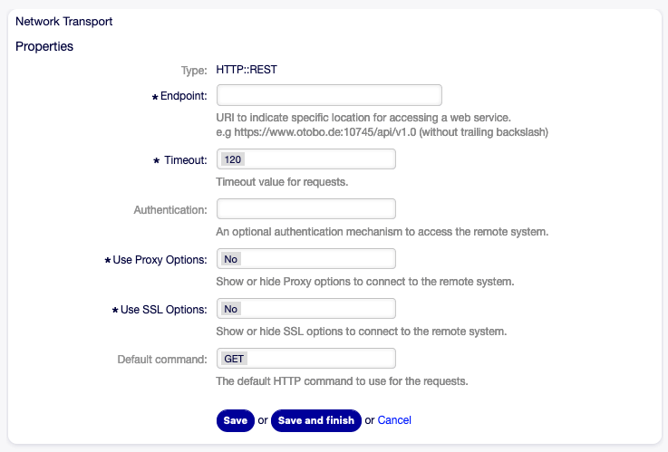

   Web Service Settings - OTOBO as Requester - HTTP\:\:REST

OTOBO as Requester - HTTP\:\:SOAP
^^^^^^^^^^^^^^^^^^^^^^^^^^^^^^^^^

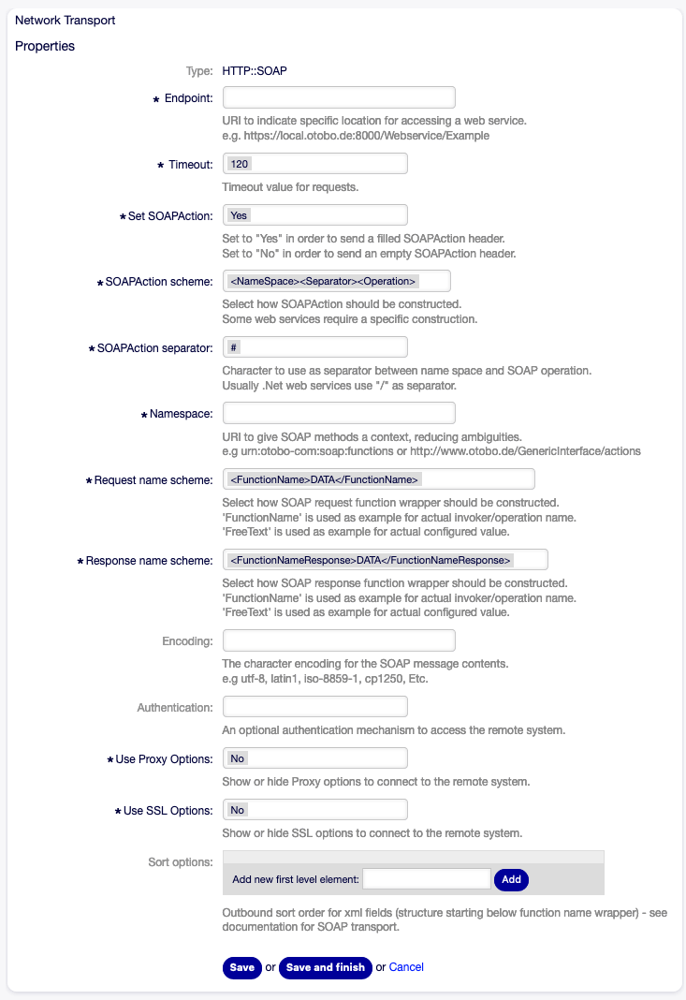

   Web Service Settings - OTOBO as Requester - HTTP\:\:SOAP

OIDC based OAuth2 authentication for Webservices
================================================

Basic Configuration (Both Provider and Invoker)
-----------------------------------------------

Your system-administrator should configure one (or more) OAuth2 Application(s) with their relevant OIDC provider and give you the following configuration details:

- the well-known provider metadata discovery url as described in the `openid spec <https://openid.net/specs/openid-connect-discovery-1_0.html#ProviderConfigurationRequest>`__  Example: '\https://keycloak:8443/realms/master/.well-known/openid-configuration'
- ``client_id`` and ``client_secret`` parameters for your OAuth2 Application
- the ``UID`` identifier of an OAuth2 JWT token claim that can be mapped to an Otobo UserLogin identifier. Usual values include 'sub', 'email', or 'uid'. Use 'sub' if in doubt.

If your planning to use functional accounts (aka System Users) to authorize outgoing API calls triggered by Otobo:

- the ``grant_type`` which will be one of: 'client_credentials' or 'password' or 'authorization_code'. if grant_type is 'password', you will also get username/password credentials
- optionally, a set of ``scope`` parameters to use. When using OIDC this likely will include 'openid'
- optionally, a set of ``resource`` ids to use.

**Important**

If you are using the 'authorization_code' flow, which will redirect your browser to the Provider login page to authenticate, the OIDC Provider will redirect you back to your Otobo instance when the authentication was successful.
For this to work the 'redirect_uri' that points back to you Otobo instance must be an allowed redirect_uri configured for your OAuth2 OIDC application. The generated URL will be
``http(s)://your-otobo.fqdn/otobo/index.pl?Action=AdminOAuthTokenStore&Subaction=OAuth'``.

Note this is in addition to the Login redirect_uri which usually is
``http(s)://your-otobo.fqdn/otobo/index.pl?Action=Login'``.

Some Provider allow simple wildcards in the redirect_uri setting, like ``http(s)://your-otobo.fqdn/otobo/index.pl*`` - Please
consult your OIDC Provider documentation for details.

Otobo as Provider
=================

Basic OpenID Connect Provider Configuration in Otobo
----------------------------------------------------

For incoming OAuth2 API calls, Otobo has to authenticate the incoming OAuth2 Tokens and map them to an Otobo user.
For API calls this works using the same Authentication Modules ('AuthModule' in Config.pm) as used for Login via OpenID Connect.
If you already using Otobo for OIDC based login, you should already have a valid OIDC configuration like from the example above and **you are all set**.

Otherwise, in case you are not using OIDC for Login, but still want to use OIDC for API calls, or if you want to use a OIDC provider for API calls different from your default OIDC configuration used for login, add an additional AuthModule for OIDC.

Refer to the examples for configuring OIDC that come with your Otobo installation. The examples are in Kernel/Config/Defaults.pm line 518ff,
and this needs to be configured in ``Config.pm``.

::

   # This is an example configuration for authorization via OpenIDConnect
   # see https://openid.net/specs/openid-connect-core-1_0.html
    $Self->{AuthModule} = 'Kernel::System::Auth::OpenIDConnect';
    # Define the authentication flow, currently supported are the authorization code flow...
    $Self->{'AuthModule::OpenIDConnect::AuthRequest'}->{ResponseType} = [ 'code' ];
    # Define the additional scope (openid is added automatically and does not need to be
    # defined here). Make sure to add everything you want to interpret later.
    $Self->{'AuthModule::OpenIDConnect::AuthRequest'}->{AdditionalScope} = [
        qw/profile email/
    ];
    # Set the ClientID and Redirect URI exactly as defined on the authorization server
    # for the latter the Action must be "Login"
    $Self->{'AuthModule::OpenIDConnect::Config'}{ClientSettings} = {
        ClientID    => 'abc123',
        RedirectURI => 'https://my.otobo.server/otobo/index.pl?Action=Login',
    };
    # For the authorization code flow the client secret has to be provided
    $Self->{'AuthModule::OpenIDConnect::Config'}{ClientSettings}{ClientSecret} = 's3cr3t';
    # Provide the URL of the well-known openid-configuration of the OpenID provider
    $Self->{'AuthModule::OpenIDConnect::Config'}{ProviderSettings} = {
        OpenIDConfiguration => 'https://keycloak:8080/auth/realms/MyRealm/.well-known/openid-configuration',
        TTL                 => 60 * 30,      # optional: time period the extracted openid-configuration is cached
        Name                => 'Intern4',    # optional: necessary only if one needs to differentiate between User and CustomerUser configuration e.g.
        SSLOptions          => {             # if special ssl options are needed; SSLVerifyHostname => 0 and SSLVerifyMode => 0 are also possible but should only be used for testing purposes
            SSLCertificate => 'SSL_cert_file',     # client certificate
            SSLKey         => 'SSL_key_file',      # client cert key
            SSLPassword    => 'SSL_passwd_cb',     # password for client cert key
            SSLCAFile      => 'SSL_ca_file',       # CA certificate
            SSLCADir       => 'SSL_ca_path',       # CA cert directory
        },
    };
    # Set the token claim to be used as identifier
    $Self->{'AuthModule::OpenIDConnect::UID'} = 'sub';
    # Some optional additional settings
    $Self->{'AuthModule::OpenIDConnect::Config'}{Misc} = {
        UseNonce   => 1,      # add a nonce to request and token (this is primarily important for the implicit flow where it is enabled by default)
        RandLength => 22,     # length for state and nonce random strings - default: 22
        RandTTL    => 60 * 5, # valid time period for state and nonce (roughly the time a user can take to authenticate) - default: 300 s
        Leeway     => 2,      # leeway for small time differences between the OTOBO server and the OpenID provier - default: 2 s
    };
    # Optionally enable user authorization via the id token - hashes can be used for complex claims
    $Self->{'AuthModule::OpenIDConnect::RoleMap'} = {
        TokenAttribute => {
            TokenRole1 => 'OTOBORole1',
            TokenRole2 => 'OTOBORole2',
        },
        TokenAttribute2 => {
            abc123 => {
                TokenRole1 => 'OTOBORole1',
                TokenRole3 => 'OTOBORole3',
            }
        },
    };
    # Optionally enable user creation - this currently does not support complex claims; email is mandatory
    $Self->{'AuthModule::OpenIDConnect::UserMap'} = {
        email       => 'UserEmail',
        given_name  => 'UserFirstname',
        family_name => 'UserLastname',
    };
    # For debugging purposes and to help with building the RoleMap e.g. you can dump all IDTokens received to the log
    $Self->{'AuthModule::OpenIDConnect::Debug'}->{'LogIDToken'} = 1;

Provider Restrictions (optional)
--------------------------------

Every valid Token needs to be mapped to a system user. If an API system user does not exist for an incoming webservice call, it will be created provided the Token passes validation and any further restrictions.

To add restrictions which valid tokens are accepted for incoming webservice calls, restrict by these fields in Config.pm:

- ``UserLogin``: only accept tokens of this particular login. This must match the UserLogin value in the Otobo System (UserLogin attribute of the User entity).

- ``Scope``: a space separated list listing token's 'scope' claims that must be present in incoming tokens to be allowed

- ``Audience``: a space separated list listing token's 'aud' claims that must be present in incoming tokens to be allowed

- ``AuthorizedParty``: simple identifier that must match the token's 'azp' claim to be allowed

Usually, you would either restrict to a specific user login, or to a combination of the other values, depending on your needs.

Example for Config.pm:

::

   $Self->{'AuthModule::OpenIDConnect::Webservice::Restrictions'} = {
        UserLogin => '',
        Scope => '',
        AuthorizedParty => '',
        Audience => ''
   };

Provider Example
----------------

With above configuration for Providers in place, follow these steps to set up a *Test Provider Webservice* in Otobo:

- Navigate to **Webservices** in Admin UI
- Select **Add New Webservice** and give it Name and Description of 'Test'
- Under **Otobo as Provider**, select '\HTTP::REST' as Transport
- Click **Save**
- Add an operation and choose 'Ticket::TicketGet'
- Set Name and Description fields to 'TicketGet'
- Choose 'Simple' for both mapping types
- Click **Save and Finish**
- Click again on the previous button to configure *Network Transport: HTTP::REST*
- Enter '/GetTicket/:TicketID' for the route mapping
- Select 'GET' as the single valid request method
- Click **Save and Finish**

At this point Otobo should be set up to accept incoming calls with OAuth2 tokens for the /GetTicket/:TikcetID endpoint.

First get a token from your provider. How that works in practice depends on your OIDC provider and your remote setup, but for testing a curl call with client_credentials grant type might look similar to this example (keycloak):

::

   curl -s -k -d 'client_id=someapi' -d 'client_secret=s3cr3t' -d 'username=test1@example.com' -d 'password=test' -d 'grant_type=password' -d 'scope=openid' 'https://localhost:8443/realms/master/protocol/openid-connect/token' |jq

   # outputs
   {
     "access_token": "eyJhbG .....",
     "expires_in": 60,
     "refresh_expires_in": 1800,
     "refresh_token": "eyJh...",
     "token_type": "Bearer",
     "id_token": "eyJhb...",
     "not-before-policy": 0,
     "session_state": "3d45911d-4ea5-42a8-814c-133cba55bf8f",
     "scope": "openid email profile roles"
   }

You should receive at least an ``access_token``, whether you also get ``refresh_token`` and ``id_token`` depends on your provider settings. In most cases you would use the access_token to make webservice calls, but in some environments also passing id tokens can make sense.

Now that we have a token, invoke the *GetTicket* API endpoint we configured above. Note we pass '1' as the TicketID, which is usually present on all Otobo system-administrator
as it is the 'Welcome to OTOBO' test email. Xou can pass any TicketID that exists in your system, of course.

::

   curl -k -X GET -H'Authorization: Bearer <token from above>' 'http://localhost/otobo/nph-genericinterface.pl/Webservice/Test/GetTicket/1' | jq

   # Outputs:
   {
     "Ticket": [
       {
         "StateID": 4,
         "LockID": 2,
         "CreateBy": 1,
         "RealTillTimeNotUsed": 0,
         "UntilTime": 0,
         "TypeID": 1,
         "StateType": "open",
         "CustomerUserID": null,
         "ChangeBy": 4,
         "OwnerID": 2,
         "Title": "Hello otobo welcome1",
         "ResponsibleID": 1,
         "QueueID": 2,
         "ServiceID": "",
         "GroupID": 1,
         "EscalationTime": 0,
         "Responsible": "root@localhost",
         "TicketID": 1,
         "EscalationSolutionTime": 0,
         "State": "open",
         "CustomerID": null,
         "EscalationUpdateTime": 0,
         "TicketNumber": "2015071510123456",
         "Age": 3464340,
         "Type": "Unclassified",
         "PriorityID": 3,
         "Created": "2025-03-07 08:38:24",
         "Priority": "3 normal",
         "Queue": "Raw",
         "ArchiveFlag": "n",
         "Owner": "9dd07755-941e-4b84-ac08-4636f036d26c",
         "Changed": "2025-04-15 07:53:31",
         "SLAID": "",
         "EscalationResponseTime": 0,
         "Lock": "lock",
         "TimeUnit": 0,
         "UnlockTimeout": 1744703611
       }
     ]
   }

Otobo as Invoker
================

Whereas Otobo as Provider only has to validate incoming OAuth2 tokens, in order to make outgoing calls as Invoker Otobo needs to obtain and manage OAuth2 tokens  for one or more functional accounts.
Functional accounts for Invokers and their tokens can be managed via the dedicated Amin UI module **OAuth Functional Accounts**. Unlike Providers for incoming calls,
which use the OIDC Profile configured for authentication, the outgoing (Invoker) Webservices require a dedicated OIDC Profile setup, which can be done in antoher  dedicated Admin UI module named **OIDC Profile Management**. First, configure an OIDC Provider Profile:

In the **Admin UI**, navigate to **OIDC Profile Management**

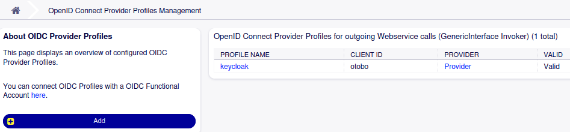

To create a new Profile, choose **Add** from the left navigation bar.

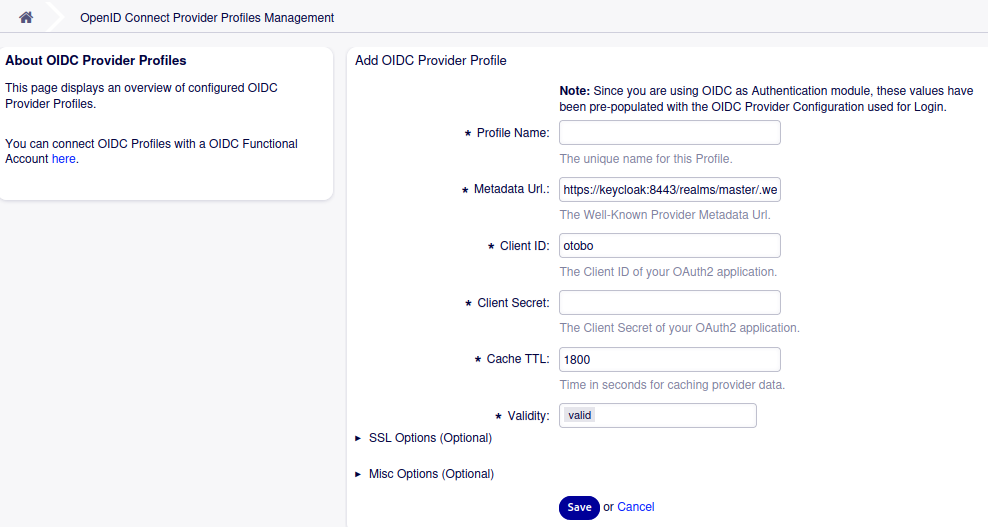

If you are already using OIDC for Login, some values will be prepopulated. You have to provide a valid, unique Profile name and also provide the OAuth2 application
client_secret value, which is not pre-populated for security reasons. Usually you can keep all the defaults, especially for the optional SSL- and Misc settings.

Now that we have an OIDC Provider Profile, we can set up a Functional Account. There can be more than one Functional Account per Profile.

In the **Admin UI**, navigate to **OAuth Functional Accounts**

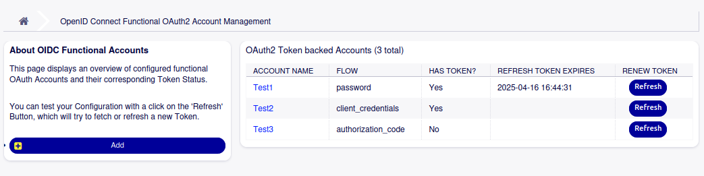

To create a new Account, choose **Add** from the left navigation bar.

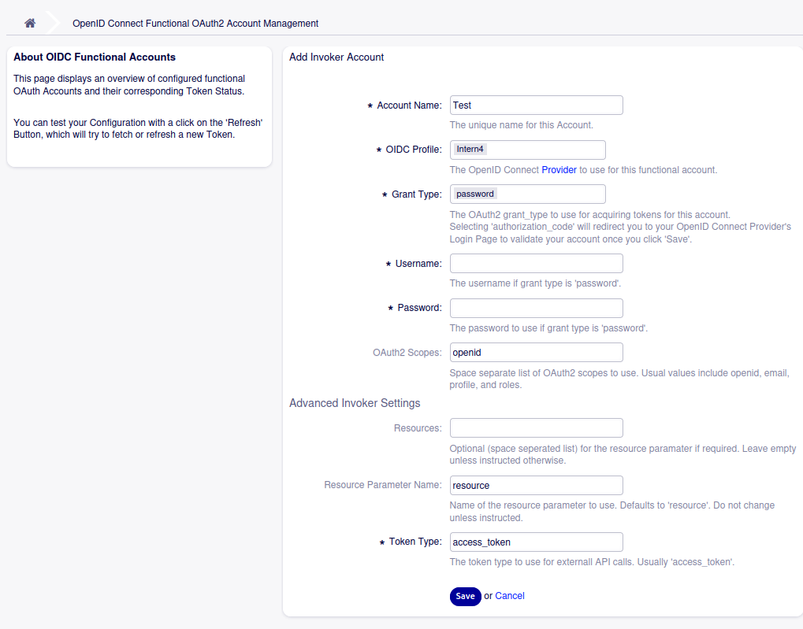

Here you give your account a Name and choose one of the OIDC Provider profiles configured earlier.
Choose the ``GrantType`` as instructed by your system administrator, and provide the ``Scope`` parameter as required. ``Scope`` will
often contain 'openid' and 'offline_access', other common values are 'email' and 'profile'.

In the **Advanced** section you can configure additional details, if needed:

- ``Resources`` : a space sperated list of resource ids to request access  for. not used in all OIDC environments
- ``ResoureParamName`` : usually 'resource', but can be overriden here
- ``TokenType``: usually 'access_token', but in some environments 'id_token' may be used

Only change advanced settings if instructed by your system administrator.

Invoker Example
---------------

Assuming you have configured at least one functional account for Invokers as per above paragraph, we can now configure a *Test Invoker Webservice*.

- Navigate to **Webservices** in Admin UI
- Select **Add New Webservice** and give it Name and Description of 'Test'
- Under **Ootobo as Requester**, select ''\HTTP::REST' as Transport
- Click **Save**
- Under **Invokers**, select the 'Generic::Passthrough' option from the dropdown
- Set Name and Description fields to 'Passthrough'
- Choose 'Simple' for both mapping types
- Click **Save**
- Under **Add Event Trigger**, choose 'Ticket' and 'ArticleEdit', remove the checkbox labeled 'Asynchronous' and click the circled plus sign **(+)**
- Click **Save and Finish**
- Click the button to configure **Network Transport: HTTP::REST**
- Enter the FQDN of the remote system to call, eg '\http://echoservice.mycompany.net', without trailing slash, under **Endpoint**
- From the **Authentication** dropdown choose 'OAuth'
- Select one of the functional accounts to use from the **OAuth2 Functional Account** dropdown
- Provide the HTTP path for the endpoint to call, eg '/rest/api/endpoint' under **Controller Mapping**
- Select 'POST' as value for **valid request commands**
- Click **Save and Finish**

At this point, Otobo should try to make an outgoing HTTP API call every time an article in a ticket gets updated, and automatically attach an OAuth2 Bearer Token to the request in the Authorization HTTP header.

To try it out:

- Select a ticket
- Add a note
- Modify the body of the note

Everytime you modify the note, your API endpoint at ``http://echoservice.mycompany.net/rest/api/endpoint`` now should receive a POST request with the article data as JSON payload in the post body.

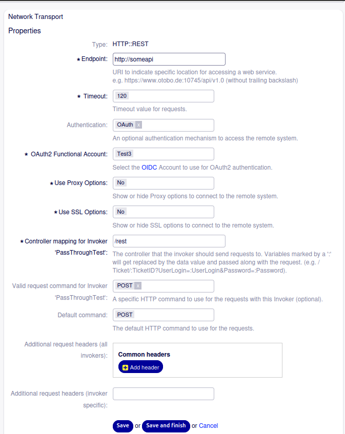

Appendix
========

Debugging Webservice Calls
--------------------------

Please note that Webservice calls using OAuth2 tokens can be debugged as usual using the built in Otobo webservice Debugger. To open the debugger for a specific webservice,
navigate to **WebServices** in the Admin UI, choose the desired webservice, and click on **Debugger** in the lefthand navigation bar.

Cronjob for updating refresh_tokens
-----------------------------------

The Cron job that keeps OAuth2 tokens up to date by making regular use of refresh_tokens ca be configured in the **System Settings** under the key ``Daemon::SchedulerCronTaskManager::Task###TokenStoreUpdater``.
By default the cronjob executes once very 60 minutes. In case your refresh_tokens expire sooner than 60 minuts, you'll need to adapt.

The only parameters to tune are the Cron Schdule expression itself, and the ``Interval`` Param. The cron expression can be any valid cron expression, examples include:

- ``0 * * * *``    - runs once per hour, at minute 0
- ``0 0 * * *``    - runs once per day, at midnight
- ``*/10 * * * *`` - runs every 10 minutes

See https://en.wikipedia.org/wiki/Cron for further details on crontab format.

For the ``Interval`` parameter set it to the time period between two scheduled task runs, in seconds. Running the cronjob once per hour gives you 60 \* 60 = 3600 seconds between each run, and thus the ``Interval`` Param should be set to 3600.

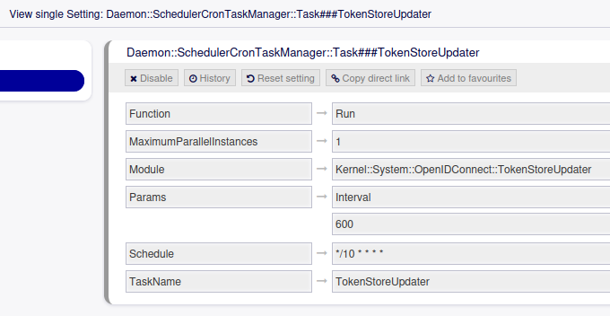

Advanced User Import
--------------------

In case of problems with the automated User import for incoming webservice calls (Provider), there is a console command to manually import a specific User
into the system. This console command can also be used for debugging OIDC/OAuth2 problems. The command comes with a '-dry-run' option that will only simulate
the import, it will do the actual handshake with the OIDC provider, but it will not actually import the user.

::

   otobo@87e0d136371d:~$ bin/otobo.Console.pl Admin::OAuth2::ImportUser --help

   Import a Functional User Account from an OpenID Connect Provider.

   Usage:
    otobo.Console.pl Admin::OAuth2::ImportUser --grant-type ...  [--openid-config ...]
    [--username ...] [--password ...] [--scope ...] [--resource ...]
    [--resource-param-name ...] [--token-type ...] [--user-map ...]
    [--role-map ...] [--uid ...]

   Options:
    [--openid-config ...]          - The name of OpenID Config to use. Defaults to
                                     'AuthModule::OpenIDConnect::Config' for using the
                                     default OIDC login provider if this system uses
                                     OIDC for login purposes. Otherwise use one of
                                     'OpenIDConnect::UserMapping###Custom1' ...
                                     CustomN Keys.
    --grant-type ...               - Specify the OAuth2 grant-type (one of
                                     password|client_credentials).
    [--username ...]               - Specify the OAuth2 username if grant-type is 'password'.
    [--password ...]               - Specify the OAuth2 password if grant-type is 'password'.
    [--scope ...]                  - Specify the OAuth2 scope(s) as a space separated list.
                                     optional.
    [--resource ...]               - Specify the OAuth2 resource parameter as a
                                     space separated list. optional.
    [--resource-param-name ...]    - Specify the OAuth2 resource parameter name, that is the
                                     name of the parameter itself. optional, defaults to 'resource'
    [--token-type ...]             - Specify the OAuth2 token type, can be 'access_token'
                                     or 'id_token'. defaults to 'id_token'.
    [--user-map ...]               - Specify the name of the UserMap system configuration
                                     setting. defaults to 'AuthModule::OpenIDConnect::UserMap'.
    [--role-map ...]               - Specify the name of the RoleMap system configuration
                                     setting. defaults to 'AuthModule::OpenIDConnect::RoleMap'.
    [--uid ...]                    - Specify the name of jwt token claim to be mapped to the
                                     Otobo UserLogin. Defaults to 'sub'
    [--help|h]                     - Display help for this command.
    [--no-ansi]                    - Do not perform ANSI terminal output coloring.
    [--quiet]                      - Suppress informative output, only retain error messages.
