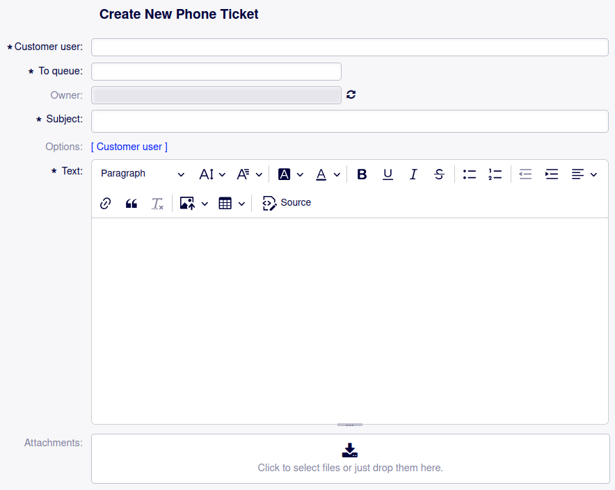
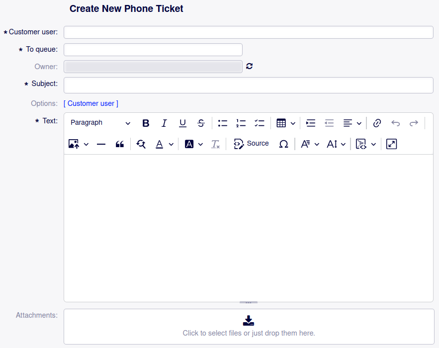
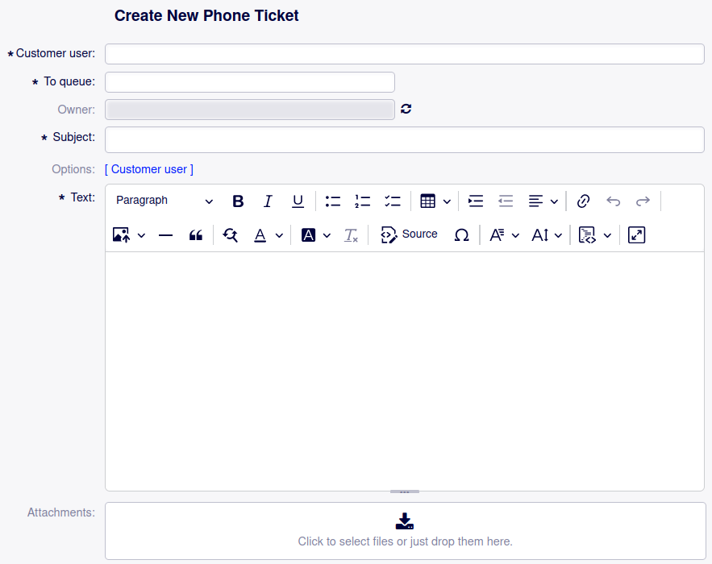

Configuring CKEditor Plugins and Toolbar
========================================

With OTOBO 11.1, the package CK5-FullWindowMode has been integrated into the core. This enables to control the plugins and toolbar content and order of the CKEditor via system configuration.

As an example, this how-to describes the steps to disable the Strikethrough functionality.

0. Default State
----------------

With default settings, the CKEditor in the agent interface looks like this:

   CKEditor in AgentTicketPhone with default settings

The Strikethrough button is available.

1. Activate the Enhanced Mode for the CKEditor Toolbar
------------------------------------------------------

For the subsequent steps to take effect, the enhanced mode for the CKEditor toolbar needs to be activated. This is done with the following steps:

    1. Navigate to the system configuration in the admin interface
    2. Navigate to the setting `Frontend::RichText::EnhancedMode`
    3. Enable editing
    4. Activate the setting by checking the checkbox
    5. Save the change and deploy the setting

2. State with Enhanced Mode
---------------------------

With the enhanced mode activated, the CKEditor looks like this:

   CKEditor in AgentTicketPhone with enhanced mode enabled

3. Change the Toolbar Configuration
-----------------------------------

The system configuration setting responsible for the CKEditor toolbar in the agent interface is the setting `Frontend::EnhancedCKEditorToolbar`.

It can be changed with the following steps:

    1. Navigate to the system configuration in the admin interface
    2. Navigate to the setting `Frontend::EnhancedCKEditorToolbar`
    3. Enable editing
    4. Remove the entry `Strikethrough` (fifth entry in the first block)
    5. Save the change and deploy the setting

4. State with Change in Place
-----------------------------

Having activated the changed system configuration setting, the CKEditor looks like this:

   CKEditor in AgentTicketPhone with enhanced mode enabled and Strikethrough removed
