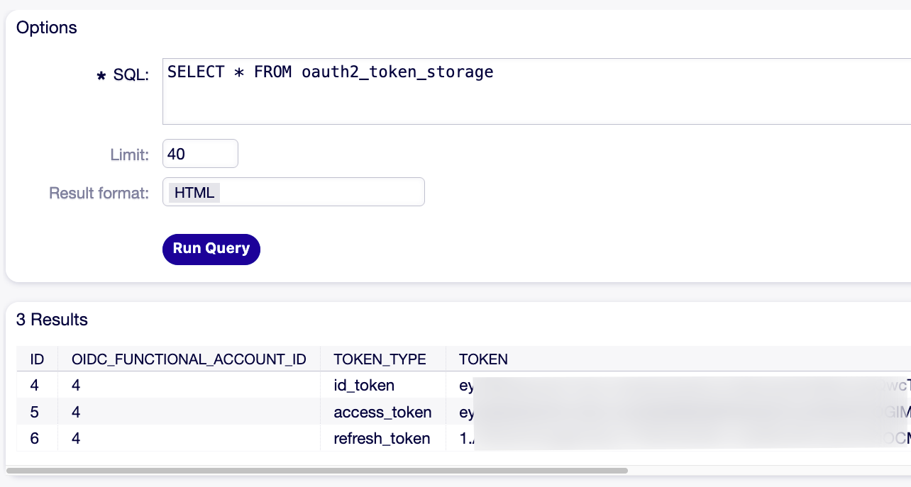
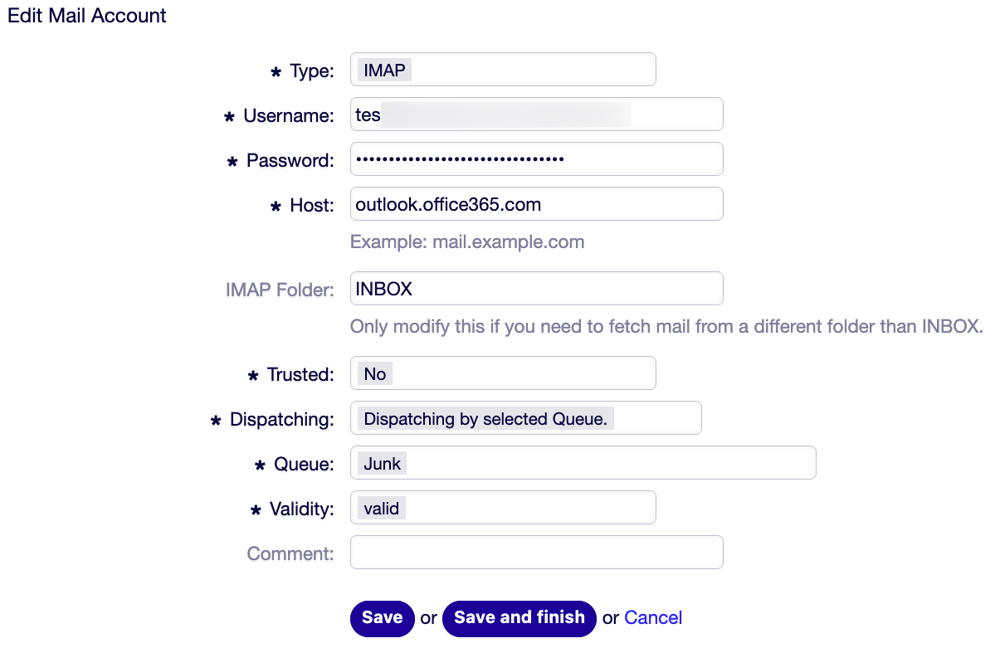
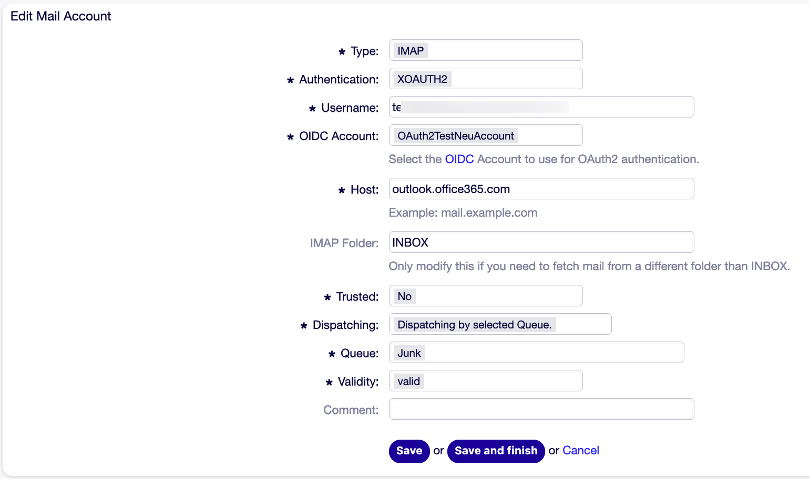
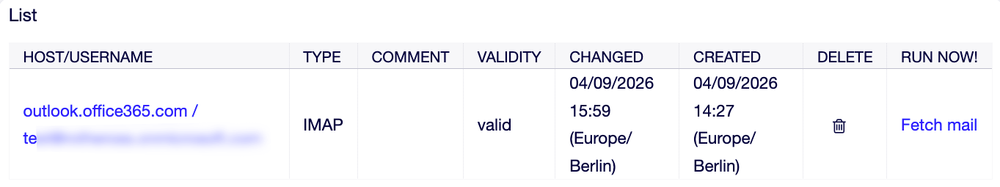
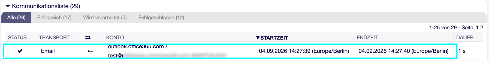

Migrate Email OAuth2 from OTOBO 11.0 to 11.1
============================================

OTOBO 11.0.x requires the package *MailAccount-OAuth2* to use OAuth2-authentication for e-mail-fetching, while OTOBO 11.1.x has this functionality included into the framework an no longer requires the package.

In order to update OTOBO 11.0.x to 11.1.x and transfer the OAuth2-settings from the package into the framework settings, the following steps are required.

.. contents:: Page Contents
   :local:
   :depth: 1

Save Settings from System Configuration
---------------------------------------

At first, some System Configuration settings of the *MailAccount-OAuth2*-package Configuration need to be stored in order to configure the package-settings in the framework after the upgrade.

#. From the System Configuration setting ``OAuth2::MailAccount::Profiles###Custom1``, store the following information:

   #. ClientID
   #. ClientSecret
   #. Name
   #. ProviderName

 .. figure:: images/01_Oauth2_MailAccount_Profiles___Custom1.png
   :alt: System Configuration Setting OAuth2::MailAccount::Profiles###Custom1

   Fields from System Configuration that must be stored

2. From the setting ``OAuth2::MailAccount::Providers###MicrosoftAzure``, store the follwing information:

   #. AuthURL
   #. TokenURL

 .. figure:: images/02_OAuth2_MailAccount_Providers___MicrosoftAzure.png
   :alt: System Configuration Setting OAuth2::MailAccount::Providers###MicrosoftAzure

   Fields from System Configuration that must be stored

..

Create a Provider Profile
-------------------------

The Provider Profile defines the communication with your E-Mail provider.

In the admin area, navigate to *OIDC Profile Management* and add a profile:

#. Profile Name - Define a name for this profile
#. Metadata Url - The Well-Known Provider Metadata Url.
#. Client ID - from section "Save Settings from System Configuration" above
#. Client Secret - section "Save Settings from System Configuration" above

 .. figure:: images/03_OIDC_Provider_Profile.png
   :scale: 65%
   :align: left
   :alt: Admin->OIDC Profile Management

   Creating a new Profile in the OIDC Profile Management

Create a Functional Account
---------------------------

The Functional Account connects your *PostMaster Mail Account* to the *Provider Profile*.

In the admin area, navigate to *OAuth Functional Accounts* and add an account:

#. Account Name - Define a name for this account
#. OIDC Profile - as defined in "Create a Provider Profile" above
#. Grant Type - select ``authorization_code`` from the dropdown-list
#. OAuth2 Scopes - ``openid offline_access``
#. Resource Parameter name - ``resource``
#. Token Type - ``access_token``

 .. figure:: images/04_Invoker_Account.png
   :alt: Admin->OAuth Functional Account

   Creating a new Account in OAuth Functional Account

7. Click [Save] and login to your Microsoft account:

   * Email, phone or Skype

   * Password

   * 2FA

8. In the overview of OIDC Functional Accounts, click the [Renew] button for the created account
9. If everything is correct, the following message appears: "Token OAuth2TestNeuAccount updated!"

..

Check the Token Presence in the Database
----------------------------------------

After the steps above, the token must be in the database.
If it is not present here, verify/repeat the steps done until here.

Navigate to Admin->SQL Box and verify the presence ot the token in the database with the following SQL-statement:

::

   SELECT * FROM oauth2_token_storage

   When the token is stored in the database, it will look like in the screenshot above

Update the PostMaster Mail Accounts
------------------------------------

The *PostMasterMail Account* settings must be changed from the former package setting to a type understandable for OTOBO also after package removal.

Before the change, stop the daemon to prevent E-Mails from being fetched after the temporary change of the *Type* below.

#. Stop the docker container for the daemon

  | Use the following shell-command:

::

   docker compose stop daemon

2. In the admin interface, navigate to *PostMaster Mail Accounts*

  | For each account, change the type from *IMAPOAuth2* to *IMAP* (or from *POP3OAuth2* to *POP3*) before removing the *MailAccount-OAuth2*-package.

   Change "Type" on each Mail Account to "IMAP" or "POP3" (depending on protocol used)

Uninstall the no longer required Package
----------------------------------------

Uninstall the package *MailAccount-OAuth2* with the Package Manager, as it will no longer be required with OTOBO 11.1.x.

..

Changes in Microsoft Azure
--------------------------

In Microsoft Azure, remove the old URI and keep only the new URI which is needed after the OTOBO upgrade:

::

   https://<OTOBO address>/otobo/index.pl?Action=AdminOAuthTokenStore&Subaction=OAuth&code=(...)

Upgrade OTOBO from 11.0.x to 11.1.x
-----------------------------------

Follow the `Documentation <https://doc.otobo.org/manual/installation/11.1/en/content/updating.html>`__ for upgrade guidance.

Clean Up PostMaster Mail Account Settings after Upgrading
---------------------------------------------------------

After the upgrade, change the authentication for all *PostMaster Mail Accounts* from *Basic Auth* to *XOAUTH2* and select *Username* and *OIDC Account* needed now for OAuth2-Authentication:

   Change "Authentication" on each Mail Account to "XOAUTH2"

Test after the Upgrade
----------------------

In the admin interface, navigate to *PostMaster Mail Accounts*.
For each account, click [Fetch mail] in the *RUN NOW!*-column

   Click [Fetch mail] here.

The message "Finished" should appear on top of the screen,
Additionally, the *Communication Log* must show the communication without errors:

   An Error-free Communcation

Start the Daemon again
----------------------

Start the Daemon to enable background activities stopped in section "Update the PostMaster Mail Accounts".

  | Use the following shell-command:

::

   docker compose up -d daemon
